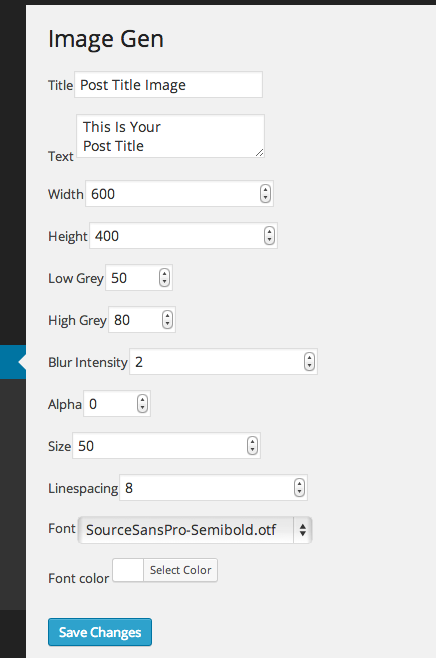

Image Gen
=========

This was created from a half-formed idea I had. As such, it doesn't have a clear use as-is, but should be extendable should I or you get around to that.

Essentially, you can fill in some options and generate an image. The image will then be added to the Media Library. After generating images you can attach them to post with the `attach` WP-CLI command. 

This image was actually generated:


This one too:


The currently-ugly options screen:



## Generating images with WP-CLI
The WP-CLI integration works really well with [https://github.com/trepmal/post-gen](Post Gen).

```
SYNOPSIS

  wp image-gen create <title> [--width=<width>] [--height=<height>]
[--lowgrey=<lowgrey>] [--highgrey=<highgrey>] [--alpha=<alpha>]
[--blurintensity=<blurintensity>] [--filename=<filename>] [--text=<text>]
[--linespacing=<linespacing>] [--textsize=<textsize>] [--font=<font>]
[--fontcolor=<fontcolor>]

OPTIONS

  <title>
    The title for the image, as will appear in the Media Library

  [--width=<width>]
    Width for the image in pixels, default 150

  [--height=<height>]
    Height for the image in pixels, default 150

  [--lowgrey=<lowgrey>]
    Lower grey value (0-255), default 120

  [--highgrey=<highgrey>]
    Higher grey value (0-255), default 150

  [--alpha=<alpha>]
    Alpha transparancy (0-127), default 0

  [--blurintensity=<blurintensity>]
    How often to apply the blur effect, default 2

  [--filename=<filename>]
    old value

  [--text=<text>]
    Text to place on the image, default empty

  [--linespacing=<linespacing>]
    Linespacing in pixels, default 10

  [--textsize=<textsize>]
    Text size in pixels, default 40

  [--font=<font>]
    Path to font true type file, default
    {plugin-path}/fonts/SourceSansPro-BoldIt.otf

  [--fontcolor=<fontcolor>]
    Font color. Either RGB as an array or a hexcode string, default array(0,
    80, 80),


EXAMPLES

    wp image-gen create "CLI Image" --text="Fancy That" --width=400 --fontcolor=c0ffee

    # To generate multiple images
    for ((i=1; i<=10; ++i)); do wp image-gen create "image-landscape"$i --text=image-$i --width=1024 --height=768 --textsize=120; done
```


## Attaching images with WP-CLI
Use the `attach` subcomand to attach images to posts. By default the images are set as a post thumbnail and will only use unattached images.
By using the `--insert` option the images are inserted between empty lines (\n\n) in the post content. 
Inserting images is done with a regular expression and can break your post content if you have empty lines inside HTML tags.

```
SYNOPSIS

  wp image-gen attach <count> [--post-type=<post-type>] [--order=<order>]
[--size=<size>] [--include-attached] [--insert] [--linkto=<linkto>]
[--align=<align>]

OPTIONS

  <count>
    Number of posts to attach an image to. Default 100

  [--post-type=<post-type>]
    Post type to attach images to. Default 'post'

  [--order=<order>]
    Order used to get the posts to attach images to
    Options - DESC, ASC, RAND. Default random order

  [--size=<size>]
    Image size, either thumbnail, medium, large, full, random or size set with add_image_size()
    Default none (uses the post thumbnail size set by theme)

  [--include-attached]
    Include already attached images to attach to posts.

  [--insert]
    Insert image in the post content instead of adding as a post thumbnail

  [--linkto=<linkto>]
    Link to file or attachment page (if --insert is used).
    Options - 'file', 'post' or 'none'. Default file

  [--align=<align>]
    Aligment of image (if --insert is used)
    Options - 'center', 'left', 'right', 'random'. Default none


EXAMPLES

    wp image-gen attach 10 --insert --align=random  --size=random
```